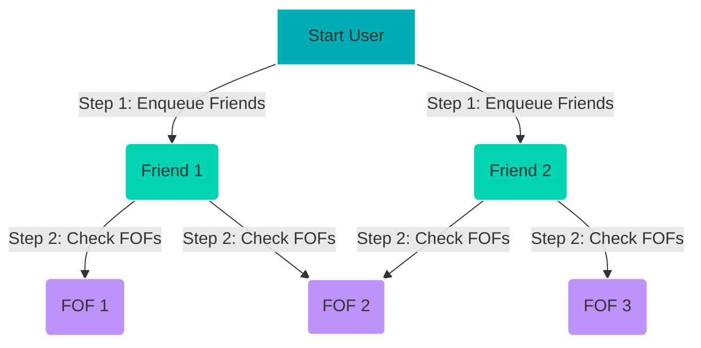

# Reconnect - Social Graph Recommendation Engine

Reconnect is an interactive, browser-based **Social Graph Recommendation Engine** that demonstrates real-world Data Structures and Algorithms (DSA) used in professional networking platforms like LinkedIn. Built entirely with Vanilla HTML5, CSS, and ES6 JavaScript, the app visualizes how social networks suggest connections and find paths using graph traversal algorithms.

---

## 🚀 Key Features

*   **Interactive Force-Directed Graph**: Visualizes profiles and connections in real-time. Drag nodes to reshape the physics-based layout.
*   **DSA Algorithm Simulator**:
    *   **BFS Friend Suggestion (Max Depth 2)**: Replays step-by-step how the engine finds "friends of friends" and ranks them based on mutual connection counts using a FIFO Queue and Visited Set.
    *   **DFS Pathfinder (Max Depth 4)**: Traces depth-first exploration to discover all unique paths connecting two users in the network using a call stack.
*   **HashMap-based Accummulator Inspector**: Shows live status updates of the inner HashMap containing mutual connection counts and traversal keys during simulations.
*   **Control Deck**:
    *   Add new professional profiles with custom brand accents.
    *   Create or sever friendships dynamically to see how recommendations update.
    *   Find shortest paths (BFS) and all paths (DFS) between any two nodes.
*   **Responsive Dark UI**: Modern glassmorphism dashboard built with curated CSS custom properties and smooth animations.

---

## 🛠️ Data Structures & Algorithms

At the core of Reconnect lies a robust JavaScript graph implementation:

1.  **Adjacency List (`Map<UserId, Set<UserId>>`)**: Represents the social network. The outer `Map` serves as a HashMap for $O(1)$ node lookups, and the inner `Set` stores direct friends for $O(1)$ connection verification.
2.  **Breadth-First Search (BFS)**:
    *   **Recommendation Engine**: Traverses the graph from the target user up to depth 2 (friends of friends). Uses a queue to explore layer-by-layer and records mutual connections in a secondary HashMap (`Map<FOFId, Array<MutualFriendId>>`). Finally, it ranks candidates by sorting the results based on mutual connection count.
    *   **Shortest Path**: Finds the minimal degrees of separation between any two users in $O(V + E)$ time.
3.  **Depth-First Search (DFS)**:
    *   **Pathfinder**: Discovers all possible connection paths between two profiles up to a custom depth limit (default 4). Avoids cycles by checking the active stack frame.

---

## 📂 Project Structure

```
Recommendation/
├── index.html       # Dashboard UI & Modal definitions
├── style.css        # Theme, layout variables, glassmorphic panel styling
├── graph.js         # Core SocialGraph class (BFS, DFS, and simulation traces)
├── mockData.js      # Initial seed dataset of 10 tech professional profiles
├── visualizer.js    # Canvas 2D engine (force simulation, highlights, node dragging)
├── app.js           # Main controller orchestrating UI events and simulation playback
└── README.md        # Documentation (this file)
```

---

## 🎮 How to Run

Since the application runs entirely client-side without external dependencies, you can start it instantly:

### Method 1: Local Double-Click
1. Open the project folder.
2. Double-click [index.html](file:///c:/Users/LENOVO/OneDrive/المستندات/Desktop/Recommendation/index.html) to open it directly in any modern web browser.

### Method 2: Live Server (Recommended)
If you have VS Code or another IDE, serve the directory using a static file server:
```bash
# E.g. using Node.js npx:
npx serve .
```

---

## ⚙️ How the Recommendation Algorithm Works (BFS)



1.  **Direct Friends** (Green Nodes) are enqueued first.
2.  **Friends of Friends (FOFs)** (Purple Nodes) are explored.
3.  When an FOF is reached via multiple paths (like `E` through both `Friend 1` and `Friend 2`), the mutual connection counter increments.
4.  The final list displays sorted suggestions, ranking candidates with higher mutual connections at the top.
